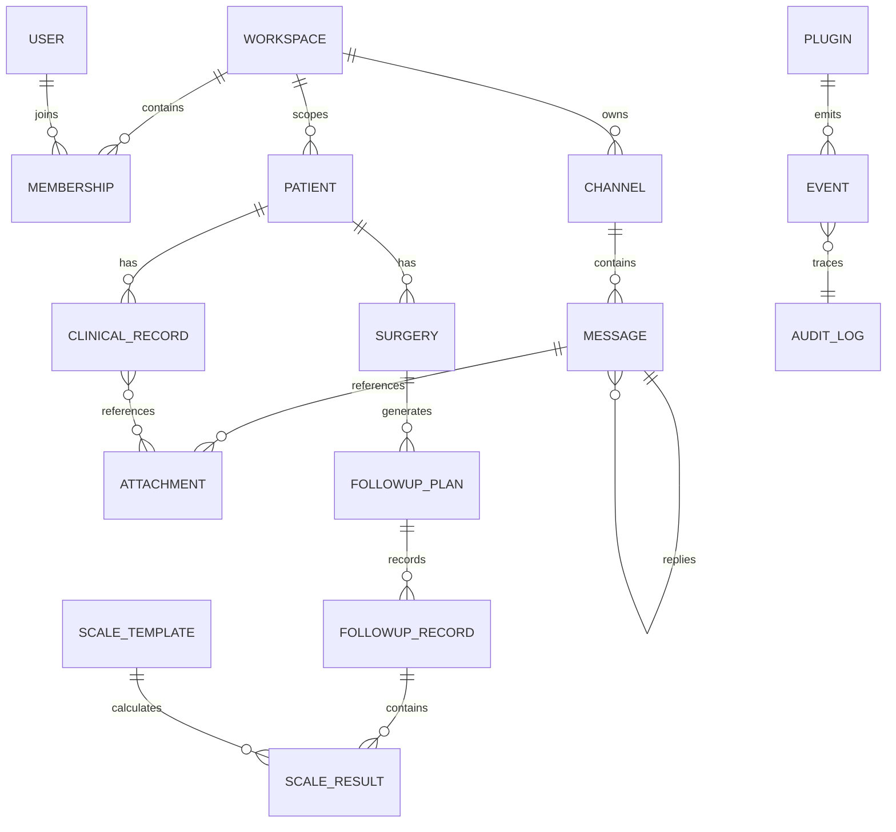
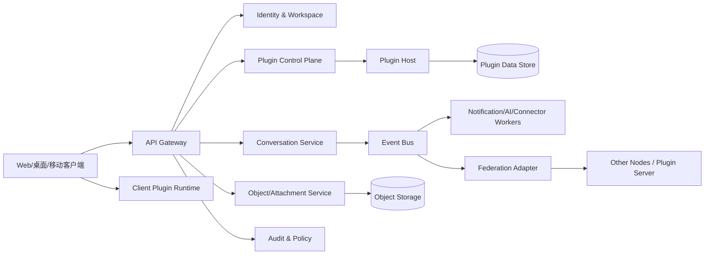

# 网络交流平台（插件化与双模式通信）
## 产品需求与技术设计基础文档

**文档版本**：0.2（整合未来规划）  
**编写日期**：2026-09-18  
**适用阶段**：产品评估、架构评审、原型设计、开发报价与首版实施  
**关联输入**：《骨科患者手术及随访管理 App 产品需求与技术要求说明书》  

### 本版变更

- 将原实施计划扩展为阶段 0–6，并把未来能力拆入当前阶段的前置设计。
- 增加多租户、可携带身份、端到端加密、离线同步、AI 代理、工作流、医疗互操作、社区治理、插件供应链、数据迁移和用量计量设计。
- 明确每阶段进入条件、退出条件和共同交付门槛。

> 本文将网络交流能力定义为平台底座，将业务能力定义为插件。骨科患者管理是首批业务插件组合之一。平台需支持中心化部署，也需为跨服务器的联邦化和点对点扩展保留协议边界。插件服务器、具体部署位置和最终通信协议由后续项目阶段确认。

---

## 1. 文档目的与范围

本文回答四个问题：

1. 平台需要提供哪些稳定的通用能力。
2. 业务功能如何以插件形式安装、启用、升级和协作。
3. AI 和其他信息软件通过哪些接口访问数据、调用能力和订阅事件。
4. 中心化交流与非中心化交流如何共存，后续如何接入插件服务器。

本文包含产品需求、技术边界、数据模型、接口约定、非功能要求、实施阶段和验收基线。本文不替代医院电子病历、PACS、正式医疗文书或其他行业系统的合规评估。

### 1.1 产品定位

平台是一个可扩展的网络交流与信息协作系统。用户在统一工作区中进行私聊、群组、频道、主题讨论和文件协作；插件向工作区增加业务对象、页面、命令、自动化流程和外部连接器；AI 或其他软件通过受控接口参与检索、分析、通知和任务执行。

### 1.2 首版目标

- 提供 Web 端可用的统一账号、工作区、权限、消息、附件、搜索和通知能力。
- 建立插件清单、扩展点、权限声明、生命周期和版本兼容机制。
- 实现中心化部署的可用版本，并完成联邦化协议抽象，不要求首版完成跨节点互通。
- 将骨科患者管理拆分为可安装插件，验证“多个业务插件组合为一个工作流”。
- 提供稳定、版本化、可审计的 REST API、事件流和 Webhook。
- 提供 AI 工具调用、知识检索和事件订阅接口，默认遵循最小权限。

### 1.3 首版不包含

- 患者自主注册、患者端填表和医患即时聊天。
- 照片 OCR、医学影像诊断和自动生成正式医疗文书。
- 可穿戴设备的实际接入；只保留数据模型和授权接口。
- 跨节点的强一致事务、匿名公共社交网络和无审核的插件执行。
- 以平台能力替代医院现有 EMR、PACS 或身份系统。

---

## 2. 原始骨科需求的结构化拆解

原说明书的主线是“患者—手术—资料—随访”。其中团队账号、权限、审计、同步、附件、任务和导出属于平台通用能力；患者、手术、量表和随访属于业务插件。

### 2.1 原需求映射

| 原需求能力 | 处理层 | 首版形式 | 说明 |
|---|---|---|---|
| 登录、团队成员、密码锁 | 平台核心 | 内置模块 | 统一身份、工作区和会话安全 |
| 患者列表、重复住院号提示、软删除 | 骨科插件 | `orthopedics-patient` | 患者主档案及查询视图 |
| 诊断、手术侧别、手术日期 | 骨科插件 | `orthopedics-surgery` | 手术实体与状态 |
| 相机、相册、多图浏览、受控下载 | 平台附件服务 + 骨科分类插件 | `media-attachments` + `orthopedics-records` | 原图、缩略图和资料分类 |
| 术后 2 周、6 周、3/6/12 个月随访 | 骨科插件 + 平台任务服务 | `orthopedics-followup` | 节点规则、补录和修订 |
| 疼痛、ROM、功能量表、并发症 | 量表插件 | `orthopedics-scales` | 模板、版本和计算规则 |
| Excel 导出、数据字典、研究编号 | 导出服务 + 骨科导出适配器 | `data-export` + `orthopedics-export` | 异步导出、审计和脱敏选项 |
| 全局搜索、到期提醒、责任医生指派 | 平台搜索/通知 + 骨科索引适配器 | `search` + `notifications` | 业务字段进入统一索引 |
| 审计日志、导出记录、权限校验 | 平台核心 | 内置模块 | 服务端强制执行，插件只能追加业务事件 |
| 患者端、设备、院内系统接口预留 | 平台连接器 | 预留 | 不在首版交付，但接口版本必须可扩展 |

### 2.2 首批插件清单

| 插件 ID | 类型 | 主要对象/能力 | 依赖 |
|---|---|---|---|
| `orthopedics-patient` | 数据 + UI | 患者档案、住院号校验、责任医生 | 身份、工作区、搜索 |
| `orthopedics-surgery` | 数据 + UI | 手术记录、侧别、术式、日期变更 | 患者插件、任务服务 |
| `orthopedics-records` | UI + 数据适配器 | 病历、手术记录、术前/术后资料分类 | 附件服务、患者插件 |
| `orthopedics-followup` | 数据 + 工作流 | 随访计划、到期任务、补录和修订 | 手术插件、任务、通知 |
| `orthopedics-scales` | 数据 + 计算 | 模板、量表版本、疼痛、ROM、并发症 | 随访插件、数据字典 |
| `orthopedics-export` | 导出适配器 | 患者主表、手术主表、随访长表、量表明细表 | 导出服务、审计 |
| `media-attachments` | 平台插件 | 上传、缩略图、预览、下载授权 | 对象存储、权限 |
| `data-export` | 平台插件 | 异步导出任务、文件生成、过期清理 | 对象存储、审计 |
| `ai-assistant` | AI 连接器 | 检索、摘要、任务建议、受控工具调用 | API 网关、事件总线 |

### 2.3 插件边界

平台核心不理解“骨科”“ROM”或某个量表的医学含义。核心只保存插件注册信息、资源标识、访问策略、事件和通用元数据。业务插件负责业务规则、字段校验、模板版本、计算公式和业务页面。

插件不得直接读写其他插件的数据库表。跨插件协作必须通过公开 API、命令或事件完成；既有数据的模板升级不得静默改变历史记录。

---

## 3. 产品原则与设计参考

### 3.1 参考 DSH 的设计做法

结合工作区中的 DSH 插件示例，平台采用以下做法：

- **主机与客户端分层**：插件可以包含服务器端运行单元和客户端 UI 单元；两者通过清晰的契约通信。
- **清单驱动**：以 `manifest` 声明入口、依赖、注入点、权限和版本，主机据此加载插件。
- **扩展点/插槽**：页面、输入区、设置页、消息操作区等由宿主提供稳定插槽，插件通过注册方式扩展。
- **可热更新但可控**：UI 和配置允许热重载；涉及依赖、数据迁移或服务端代码的变更必须进入升级流程。
- **主机负责安全**：插件不能绕过宿主权限直接访问用户数据、密钥或文件系统。

### 3.2 参考 VS Code 的设计做法

- 通过 `contributes` 声明命令、视图、菜单、设置、快捷键和上下文菜单。
- 通过 `activationEvents` 延迟加载插件，避免所有插件启动时占用资源。
- 将插件运行在隔离的 Extension Host；高风险或不可信插件使用更严格的沙箱。
- API 采用稳定版本和能力检测；插件应能优雅处理宿主缺少可选能力的情况。
- 插件市场、安装、更新、禁用、卸载和兼容性检查由宿主管理。

### 3.3 平台原则

1. 核心能力稳定，业务能力可替换。
2. 数据归属清晰，所有跨边界访问可审计。
3. 默认最小权限，权限与用户可见功能分离校验。
4. 事件可追溯，命令可幂等，接口可版本化。
5. 中心化和非中心化使用同一资源模型，差异放在传输和信任层。
6. 业务插件可组合，插件之间通过契约协作。
7. 面向弱网和移动端设计，所有长任务可恢复或重试。

---

## 4. 用户、组织与工作区

### 4.1 用户角色

| 角色 | 主要权限 |
|---|---|
| 平台超级管理员 | 管理实例、节点、插件源、系统策略和全局审计 |
| 工作区管理员 | 管理成员、角色、频道、插件启停、导出和保留策略 |
| 普通成员 | 按授权使用频道、消息和业务插件 |
| 外部协作者 | 仅访问被邀请的频道或资源，默认禁止批量导出 |
| AI/软件客户端 | 通过 OAuth2、服务账号或短期令牌按 scope 访问 |
| 联邦节点管理员 | 管理本节点身份、入站策略、出站策略和信任关系 |

### 4.2 工作区模型

- 一个用户可以加入多个工作区；每个工作区拥有独立成员、数据范围、插件配置和审计域。
- 频道属于工作区；私聊可以是工作区内会话，也可以由联邦策略允许跨节点会话。
- 插件按实例、工作区或频道启用。默认按工作区启用，敏感业务插件支持按角色限制。
- 患者等高敏感对象默认只在指定工作区可见；跨工作区共享必须有明确授权和审计记录。

### 4.3 权限模型

采用 RBAC + 资源级 ACL + scope 三层模型：

- RBAC 决定角色能做什么。
- ACL 决定某个用户或群组能访问哪个频道、患者或附件。
- scope 限制 API 客户端和插件可调用的资源与动作。

敏感动作包括查看原图、批量查询、导出、彻底删除、修改权限、跨节点发布和调用外部 AI。所有敏感动作由服务端再次校验。

---

## 5. 信息架构与核心功能

### 5.1 一级导航

1. **首页**：未读、待办、到期提醒、最近频道和插件入口。
2. **消息**：私聊、群聊、频道、主题和消息搜索。
3. **工作区**：成员、频道、业务对象和插件页面。
4. **插件**：已安装、可用、更新、权限和配置。
5. **任务**：个人和团队任务，包括插件创建的随访任务。
6. **管理**：成员、权限、审计、存储、通知、联邦节点和系统设置。

### 5.2 交流功能

#### 5.2.1 会话和频道

- 支持一对一私聊、多人私聊、公开频道、私有频道和主题线程。
- 频道可绑定一个或多个插件视图，例如“骨科随访”频道绑定随访看板。
- 消息支持文本、Markdown、图片、文件、引用、回复、编辑、撤回、表情和系统卡片。
- 消息保存作者、来源节点、创建时间、编辑历史、可见范围和关联资源。
- 允许插件向消息区注册卡片、操作按钮、命令和上下文菜单。

#### 5.2.2 搜索和通知

- 支持按关键词、作者、频道、时间、附件类型、插件对象和标签搜索。
- 业务插件通过索引适配器注册可搜索字段，不直接修改平台搜索表。
- 支持站内通知、Web Push、邮件或第三方通知连接器；通知内容默认不包含完整敏感身份信息。
- 通知必须可定位到消息、任务或业务对象，并支持已读、稍后处理和免打扰时间。

#### 5.2.3 文件和附件

- 统一附件服务负责上传、分片、断点续传、类型检查、病毒扫描、缩略图和短期下载授权。
- 插件只保存附件引用、分类和业务关联，不复制二进制文件。
- 原图和预览图分层存储；缓存可配置清理，移动端敏感缓存加密。

### 5.3 AI 与软件协作

AI 或其他信息软件可扮演四类角色：

1. **阅读者**：按授权检索消息、附件元数据和插件对象。
2. **分析器**：接收结构化数据，返回摘要、分类、统计或建议。
3. **工具调用者**：调用已授权的命令，例如创建任务、发送草稿、生成导出任务。
4. **事件订阅者**：订阅新消息、对象变更、任务到期等事件。

AI 输出默认标记为“机器生成”，不得自动写入医疗结论或替代人工确认。涉及外部模型时，工作区管理员必须能够限制可发送的字段、目的地、保留期限和脱敏规则。

### 5.4 插件管理

- 插件目录显示名称、版本、作者、来源、权限、依赖、兼容宿主版本和更新日志。
- 安装前展示权限和数据访问范围；高风险权限需要管理员确认。
- 支持安装、启用、停用、更新、回滚、卸载、配置和查看运行日志。
- 插件更新前执行兼容性检查、数据迁移预览和备份；失败时自动回滚代码和配置。
- 插件源支持官方源、组织私有源和后续提供的插件服务器；默认只信任已登记来源。

---

## 6. 插件系统设计

### 6.1 插件类型

| 类型 | 运行位置 | 适用场景 |
|---|---|---|
| UI 插件 | Web/桌面/移动端 | 页面、面板、命令、消息卡片 |
| 服务插件 | 服务端插件主机 | 数据模型、业务规则、任务、Webhook |
| 连接器插件 | 服务端或边缘节点 | AI、邮件、医院系统、设备和存储 |
| 工作流插件 | 工作流运行时 | 触发器、条件、审批、自动化任务 |
| 数据插件 | 数据服务 | 新增对象、索引、导入导出和数据字典 |

一个产品功能可以由多个插件组成。例如骨科首版由患者、手术、资料、随访、量表和导出插件组合，平台负责统一导航、权限、消息和审计。

### 6.2 插件清单

建议使用 JSON 清单，字段如下：

```json
{
  "id": "org.example.orthopedics-followup",
  "version": "0.1.0",
  "displayName": "骨科随访",
  "publisher": "org.example",
  "engines": { "platform": ">=0.1.0 <0.2.0" },
  "runtime": {
    "server": { "entry": "dist/server.js", "isolation": "sandbox" },
    "client": { "entry": "dist/client.js", "platforms": ["web", "desktop", "mobile"] }
  },
  "activationEvents": [
    "onWorkspace",
    "onCommand:orthopedics.followup.open",
    "onEvent:orthopedics.surgery.created"
  ],
  "contributes": {
    "commands": [{ "id": "orthopedics.followup.open", "title": "打开随访" }],
    "views": [{ "id": "orthopedics.followup.dashboard", "location": "workspace.home" }],
    "messageActions": [{ "id": "orthopedics.followup.create", "when": "channel.type == 'orthopedics'" }],
    "settings": [{ "key": "defaultFollowupNodes", "type": "array" }],
    "dataSchemas": ["schemas/patient.json", "schemas/followup-record.json"]
  },
  "permissions": [
    "workspace.read",
    "patient.read",
    "patient.write",
    "task.create",
    "attachment.read.metadata"
  ],
  "dependencies": { "org.example.task-service": ">=0.1.0" },
  "configuration": { "scales": [], "retentionDays": 2555 }
}
```

### 6.3 扩展点

首版必须稳定以下扩展点：

- `workspace.home`：工作区首页卡片和仪表盘。
- `workspace.sidebar`：工作区导航项。
- `conversation.input`：输入框工具、AI 模式、附件和命令。
- `message.actions`：消息操作、引用、转任务和插件动作。
- `message.renderer`：业务卡片和结构化消息。
- `channel.header`：频道状态、筛选器和业务快捷操作。
- `object.detail`：患者、任务或其他插件对象的详情页标签。
- `settings.section`：插件配置页。
- `command.palette`：命令注册。
- `search.provider`：插件字段和对象进入统一搜索。
- `event.handler`：按事件触发后台任务。

扩展点必须包含宿主版本、输入输出类型、权限要求和错误处理约定。宿主缺少可选扩展点时，插件应隐藏对应功能并继续运行。

### 6.4 生命周期

`发现 → 下载 → 校验签名 → 安装 → 依赖解析 → 配置 → 启用 → 激活 → 停用 → 更新/回滚 → 卸载`。

- 安装包必须具有内容哈希和来源信息。
- 服务插件升级必须提供迁移脚本的版本范围和回滚策略。
- 停用插件后，既有数据保留策略由工作区管理员决定；数据不得因停用而静默删除。
- 卸载前显示仍被其他插件引用的对象、任务和扩展点。

### 6.5 权限与隔离

插件权限采用显式声明、管理员授权、运行时检查和审计记录四步流程。建议权限命名：

- `workspace.read`、`workspace.manage`
- `conversation.read`、`conversation.write`
- `object.<type>.read`、`object.<type>.write`
- `attachment.read.metadata`、`attachment.read.content`
- `task.create`、`notification.send`
- `search.register`
- `external.network`、`external.ai`
- `federation.publish`

默认禁止任意网络请求、任意文件访问、任意数据库访问和读取其他工作区数据。插件服务运行在隔离进程或容器中，资源使用设置 CPU、内存、并发和超时上限。

### 6.6 版本和兼容性

- 平台 API 使用 `v1`、`v2` 等主版本；主版本内保持向后兼容。
- 插件清单声明支持的平台版本、客户端平台和可选能力。
- 宿主提供能力探测接口，如 `capabilities.has("message.card.v1")`。
- 数据 schema、事件名和命令 ID 一旦发布不得复用；废弃接口至少保留一个兼容周期。

---

## 7. API、事件和连接器

### 7.1 通用接口原则

- 使用 HTTPS；JSON 默认采用 UTF-8。
- REST API 路径带版本，如 `/api/v1/workspaces/{workspaceId}/channels`。
- 所有资源使用不可变唯一 ID；姓名、住院号和显示名称不能作为主键。
- 支持分页、筛选、排序、幂等键、条件更新、错误码和请求追踪 ID。
- 长任务返回 `jobId`，通过查询接口、SSE 或 Webhook 获取进度。
- API 响应不得泄露调用者无权访问的字段；服务端完成最终过滤。

### 7.2 核心接口目录

| 方法 | 路径 | 用途 |
|---|---|---|
| `POST` | `/api/v1/auth/token` | 登录或换取访问令牌 |
| `GET` | `/api/v1/workspaces` | 获取用户可见工作区 |
| `GET/POST` | `/api/v1/workspaces/{id}/channels` | 查询或创建频道 |
| `GET/POST` | `/api/v1/channels/{id}/messages` | 查询或发送消息 |
| `POST` | `/api/v1/messages/{id}/actions` | 执行消息动作 |
| `GET` | `/api/v1/search` | 全局搜索 |
| `POST` | `/api/v1/attachments/uploads` | 创建上传任务 |
| `GET` | `/api/v1/attachments/{id}/download-url` | 获取短期下载地址 |
| `GET` | `/api/v1/plugins` | 查询插件目录和已安装状态 |
| `POST` | `/api/v1/plugins/{id}/install` | 安装或更新插件 |
| `POST` | `/api/v1/plugins/{id}/state` | 启用、停用或回滚 |
| `GET` | `/api/v1/events/stream` | SSE 事件流 |
| `POST` | `/api/v1/webhooks/{subscriptionId}/test` | 测试 Webhook |
| `POST` | `/api/v1/ai/runs` | 创建 AI 任务或工具调用 |
| `GET` | `/api/v1/ai/runs/{id}` | 查询 AI 任务状态 |
| `POST` | `/api/v1/export/jobs` | 创建导出任务 |
| `GET` | `/api/v1/audit-logs` | 按权限查询审计日志 |

### 7.3 事件信封

所有事件使用统一信封，便于中心化消息总线和联邦转发：

```json
{
  "id": "evt_01J...",
  "type": "orthopedics.followup.due",
  "version": "1",
  "occurredAt": "2026-09-18T08:00:00Z",
  "source": { "nodeId": "node-a", "pluginId": "org.example.orthopedics-followup" },
  "workspaceId": "ws_01J...",
  "actor": { "type": "user", "id": "usr_01J..." },
  "subject": { "type": "followup", "id": "fol_01J..." },
  "visibility": { "type": "workspace", "ref": "ws_01J..." },
  "data": { "patientId": "pat_01J...", "node": "6_weeks" },
  "traceId": "tr_01J...",
  "signature": { "algorithm": "Ed25519", "keyId": "node-a-2026-01" }
}
```

事件处理器必须支持幂等。重复事件以 `id` 去重；事件顺序只在同一 `subject` 内保证，跨节点事件允许延迟和重排。

### 7.4 AI 接口

AI 连接器使用独立的 scope 和数据策略：

```json
{
  "model": "configured-by-workspace",
  "input": {
    "type": "conversation.context",
    "channelId": "ch_01J...",
    "messageIds": ["msg_01J..."],
    "includeAttachments": false
  },
  "tools": [
    { "name": "search.objects", "scope": "orthopedics.patient.read" },
    { "name": "tasks.create", "requiresConfirmation": true }
  ],
  "policy": {
    "redaction": ["patient.name", "patient.hospitalNumber"],
    "retention": "provider-default-disabled"
  }
}
```

- 读操作可按策略自动执行；写操作、发消息、导出和跨节点发布默认需要人工确认。
- AI 工具结果包含来源对象 ID、时间和权限快照，便于追溯。
- 禁止把插件服务密钥、用户密码或长期令牌发送给模型。
- 支持 OpenAI 兼容接口、内部模型接口和后续 MCP/工具协议适配器；具体协议由连接器实现，平台只规定权限和审计契约。

### 7.5 外部软件接入

提供 OAuth2/OIDC、服务账号、短期 API Key 和签名 Webhook 四种方式：

- OAuth2 适合用户授权的第三方应用。
- 服务账号适合医院系统、定时任务和内部机器人。
- 短期 API Key 适合开发测试，不得替代长期身份治理。
- Webhook 使用签名、时间戳和重放保护；失败采用指数退避并进入死信队列。

---

## 8. 数据模型

### 8.1 平台核心实体

| 实体 | 关键字段 | 备注 |
|---|---|---|
| `User` | `id, displayName, status, identityRefs` | 平台用户，不保存业务专属字段 |
| `Workspace` | `id, name, owner, policy` | 数据和插件配置隔离域 |
| `Membership` | `workspaceId, userId, role, status` | 成员与角色 |
| `Channel` | `id, workspaceId, type, visibility` | 私聊、群聊、公开/私有频道 |
| `Message` | `id, channelId, author, body, revision` | 编辑和撤回保留历史 |
| `Thread` | `id, rootMessageId` | 主题讨论 |
| `Attachment` | `id, objectKey, mediaType, hash, policy` | 二进制统一由附件服务管理 |
| `Task` | `id, assignee, dueAt, state, source` | 平台任务，插件可扩展字段 |
| `Plugin` | `id, version, manifest, source, state` | 安装和运行状态 |
| `Event` | `id, type, subject, data, signature` | 事件总线和联邦传输 |
| `AuditLog` | `id, actor, action, resource, result, traceId` | 防篡改、可检索 |
| `Connector` | `id, type, scopes, endpoint, secretRef` | AI、邮件、院内系统等 |
| `FederationPeer` | `nodeId, endpoint, trust, keySet` | 后续联邦节点 |

所有实体包含 `createdAt`、`updatedAt`、`createdBy`、`updatedBy` 和 `status`。删除优先使用软删除和保留策略；彻底删除必须记录审批或策略来源。

### 8.2 骨科插件实体

| 实体 | 关键字段 | 关系 |
|---|---|---|
| `Patient` | `id, workspaceId, name, sex, hospitalNumber, diagnosis, ownerId, status` | 一个患者可有多次手术 |
| `Surgery` | `id, patientId, procedure, side, surgeryDate, status` | 生成随访计划 |
| `ClinicalRecord` | `id, patientId, category, timing, recordDate, attachmentRefs` | 病历和检查资料引用附件 |
| `FollowupPlan` | `id, surgeryId, templateVersion, nodes` | 固定节点和临时节点 |
| `FollowupRecord` | `id, planId, node, recordedAt, version, missingReasons` | 同一节点可多次记录 |
| `ScaleTemplate` | `id, name, version, items, scoringRule, license` | 模板版本化 |
| `ScaleResult` | `id, followupRecordId, templateId, rawValues, score` | 保存原始值和计算结果 |
| `ExportProfile` | `id, fields, anonymization, dataDictionaryVersion` | 导出配置和研究编号规则 |

患者插件不得把患者 ID 暴露为消息正文中的隐式主键。消息引用患者时使用受权限保护的对象引用卡片。

### 8.3 关系图



---

## 9. 中心化与非中心化通信设计

### 9.1 两种模式

| 项目 | 中心化模式 | 非中心化/联邦模式 |
|---|---|---|
| 权威数据 | 单一平台实例或组织主库 | 每个节点保留本地权威数据 |
| 登录 | 平台统一身份 | 本节点身份 + 跨节点信任 |
| 消息路由 | 中央服务实时投递 | 节点间异步投递，可经过中继 |
| 一致性 | 单节点内强一致 | 最终一致，允许延迟和重排 |
| 搜索 | 中央索引 | 本地搜索 + 授权的跨节点查询 |
| 离线 | 本地草稿和同步 | 本地队列、签名事件和冲突处理 |
| 删除 | 平台保留策略 | 需传播删除声明，并受本地法律/策略约束 |
| 适用场景 | 医院团队、企业工作区 | 多机构协作、社区频道、跨组织订阅 |

首版先实现中心化模式和统一事件信封；联邦化先完成节点标识、签名、投递、重试、撤回和权限策略接口。

### 9.2 联邦化资源原则

- 每个节点拥有稳定 `nodeId` 和 Ed25519 密钥。
- 全局资源标识使用 `nodeId + localId` 或 URI 形式，避免不同节点冲突。
- 节点间只传输接收方有权获取的字段；敏感附件默认不跨节点复制。
- 消息和对象变更采用签名事件；接收节点验证来源、时间窗、权限和重放状态。
- 冲突解决按资源类型定义：消息追加为主，配置使用版本号，业务记录使用人工合并或修订版本。
- 节点可配置允许的对端、频道、对象类型、数据字段、速率和保留期。

### 9.3 协议适配层

平台定义 `TransportAdapter` 接口，不在核心业务中绑定某一种协议：

```ts
interface TransportAdapter {
  publish(event: SignedEvent, target: Target): Promise<DeliveryReceipt>
  subscribe(filter: EventFilter, handler: EventHandler): Promise<Subscription>
  revoke(subject: ResourceRef, reason: string): Promise<void>
  health(): Promise<AdapterHealth>
}
```

后续可实现中心化消息总线、Matrix 适配器、ActivityPub 公共内容适配器、WebRTC/P2P 适配器或插件服务器自定义适配器。具体选择需要结合身份、隐私、离线和运维要求评估。

---

## 10. 技术架构与部署

### 10.1 逻辑架构



### 10.2 服务边界

- **客户端插件运行时**：加载 UI 插件、注册扩展点、调用宿主 API，不持有服务端密钥。
- **API Gateway**：鉴权、限流、版本路由、请求追踪和统一错误格式。
- **Identity & Workspace**：用户、工作区、成员、角色、OAuth/OIDC。
- **Conversation Service**：频道、消息、线程、反应和已读状态。
- **Object/Attachment Service**：上传、扫描、缩略图、下载授权和生命周期。
- **Plugin Control Plane**：插件目录、安装、签名、兼容性、启停和升级。
- **Plugin Host**：隔离运行服务插件、任务和连接器。
- **Event Bus**：事件持久化、消费组、重试、死信和联邦投递。
- **Policy & Audit**：权限、脱敏、保留、审计和安全策略。

### 10.3 插件服务器预留

后续插件服务器由项目方提供时，应满足以下接入协议：

1. 提供插件清单、版本、兼容宿主版本和内容哈希。
2. 提供签名公钥或可验证的签名链。
3. 支持插件包下载、分块传输、断点续传和版本查询。
4. 提供健康检查、能力描述、依赖清单和迁移说明。
5. 支持按工作区授权和撤销，不把管理凭据下发到客户端。
6. 可通过 `TransportAdapter` 提供事件中继或联邦连接。
7. 服务端插件必须声明所需资源、外网域名、数据保留期和故障降级行为。

插件服务器不可用时，已安装且已缓存的插件应继续提供允许的本地功能；新安装、更新和需要远端连接的功能应显示明确状态。

### 10.4 推荐技术约束

技术选型可由开发方提出，但必须说明取舍。首版建议：

- 客户端：Web 优先，移动端可采用 Flutter 或 React Native；UI 插件 API 保持跨端能力子集。
- 服务端：模块化单体起步，插件服务通过进程/容器隔离；规模增长后再拆分服务。
- 数据库：关系数据库保存核心对象和权限；对象存储保存附件；搜索引擎保存可重建索引。
- 实时通信：WebSocket 或 SSE；消息写入使用幂等键。
- 任务和事件：持久化队列，支持重试和死信。
- 监控：结构化日志、指标、分布式追踪、插件健康状态和审计告警。

---

## 11. 安全、隐私与数据治理

平台可能处理患者身份、诊断、手术、随访和组织内部通信，按高敏感数据设计：

- 传输使用 TLS；数据库、对象存储、备份和移动端敏感缓存加密。
- 密码使用强散列和盐值；配置失败限制、异常登录告警和会话撤销。
- 管理员、插件和 AI 客户端均采用最小权限；客户端隐藏按钮不能替代服务端校验。
- 访问、查看原图、新增、修改、删除、恢复、导出、权限变化、插件安装和跨节点投递均写入审计。
- 原图使用私有对象存储和短期授权 URL；禁止永久公开链接。
- 测试环境不得直接使用未经脱敏的真实患者数据。
- 工作区可配置数据区域、保留期、删除审批、备份周期和恢复目标。
- AI 连接器支持字段级脱敏、目的地白名单、调用确认和输出保留策略。
- 联邦节点仅发布被授权字段；撤回、删除和权限变化需要生成可验证事件。
- 发生设备丢失、账号离职、密钥泄露或外部连接器异常时，管理员可立即吊销会话、令牌和节点信任。

---

## 12. 非功能要求

### 12.1 性能

- 正常网络下首页、频道摘要和常用详情页在 2 秒内呈现可用内容。
- 消息发送接口 P95 小于 500 ms（不含外部连接器处理）。
- 大附件采用渐进加载；列表使用分页或增量加载，不一次加载全部图片。
- 单个插件不得阻塞宿主主线程；后台任务必须有超时和并发上限。

### 12.2 可用性和恢复

- 中心化服务目标可用性由部署方确认，首版建议月度可用性不低于 99.5%。
- 网络中断时保留草稿和待发送队列；恢复后显示同步状态和冲突结果。
- 数据库、对象存储和插件配置应有备份、恢复演练和恢复点目标。
- 事件消费失败进入重试和死信队列，不得无限重试造成重复操作。

### 12.3 易用性和兼容性

- 支持单手操作、键盘快捷键、清晰的保存/失败提示和未保存离开提醒。
- 日期、数字、角度和量表输入使用匹配控件；缺失值与数值 0 分开。
- 支持中文和英文文案，时区、日期格式和数字格式可配置。
- 明确最低 Web 浏览器、Android、iOS 和桌面版本，并提供测试设备清单。
- 支持可访问性基础要求：键盘操作、焦点顺序、对比度、替代文本和屏幕阅读器标签。

### 12.4 可观测性

平台必须提供请求 ID、事件 ID、插件 ID 和版本等关联字段。管理员可查看服务状态、插件健康、队列积压、失败事件、外部连接器状态和审计结果。日志不得记录密码、完整令牌、原始医疗图片或不必要的患者身份信息。

---

## 13. 实施阶段（已整合未来需求）

实施计划按“首版可用、未来可扩展、每阶段可回滚”组织。未来能力不会全部提前实现，但会在前置阶段落实数据字段、接口版本、权限边界和迁移策略，避免后续改动核心对象。

### 13.1 阶段总览

| 阶段 | 目标 | 交付范围 | 进入条件 | 退出条件 |
|---|---|---|---|---|
| 0 | 需求确认与架构冻结 | 治理、数据字典、插件协议、威胁模型、原型 | 项目主体和试点场景确定 | 关键决策清单关闭，API/事件草案评审通过 |
| 1 | 平台核心 MVP | 账号、工作区、消息、附件、搜索、插件运行时、审计 | 阶段 0 完成 | 中心化端到端场景通过，数据可导出和恢复 |
| 2 | 骨科业务试点 | 患者、手术、资料、随访、量表、导出插件 | 核心 API 稳定 | 临床团队试用，关键验收场景通过 |
| 3 | AI 与外部连接 | AI 工具、工作流、连接器、数据脱敏、医疗映射 | 权限和审计达标 | AI 调用可追溯，外部系统失败可恢复 |
| 4 | 联邦化与插件服务器 | 节点身份、签名事件、适配器、插件服务器接入 | 阶段 3 事件契约稳定 | 两节点模拟互通，插件可签名安装和回滚 |
| 5 | 企业级安全与规模 | SSO/SCIM、Passkey、多租户、多区域、端到端加密、供应链治理 | 试点稳定、运维指标达标 | 安全评估、灾备演练和扩容测试通过 |
| 6 | 开放生态与代理网络 | AI 代理协作、实时媒体、社区治理、公共插件市场、计量计费 | 节点和插件生态有明确治理方 | 生态审核、用量计量和风险处置流程运行 |

### 13.2 阶段 0：确认与架构冻结

除原有产品和合规确认外，本阶段必须一次性确认会影响核心数据的长期决策：

- 租户层级：实例、组织、工作区、频道的隔离关系。
- 身份来源：本地账号、OIDC/SAML、Passkey、外部身份映射和账号合并规则。
- 数据分类：普通通信、组织机密、患者健康数据、密钥材料和可公开内容。
- 消息加密策略的演进路径，即使首版只实现服务器端加密，也需确定字段和密钥引用。
- 插件清单、扩展点、权限 scope、事件信封、数据 schema 和版本废弃规则。
- 离线写入的幂等键、版本字段、冲突策略和客户端队列格式。
- AI/代理主体、工具目录、人工确认、数据脱敏、模型版本和调用留痕。
- 联邦节点 ID、签名算法、撤回语义、传输适配器和跨节点字段白名单。
- 数据导出包、导入预演、备份恢复、插件停用和合作终止时的交接格式。

本阶段输出信息架构、核心页面原型、插件开发者指南、权限矩阵、数据字典、威胁模型、OpenAPI/AsyncAPI 草案和决策记录（ADR）。

### 13.3 阶段 1：平台核心 MVP

交付账号、工作区、角色、频道、消息、线程、附件、搜索、通知、审计、插件清单、客户端运行时、服务端插件主机、REST API、SSE/WebSocket、Webhook、异步任务和基础管理后台。

为未来需求同步实现以下轻量基础能力：

- 核心表统一带 `tenantId`、外部身份引用、版本、来源节点和保留策略字段。
- 统一权限策略服务，支持资源 ACL、scope、字段脱敏和策略模拟。
- 事件总线支持持久化、幂等、重试、死信、签名字段和事件回放。
- 插件包签名校验、权限差异展示、兼容性检查、停用、回滚和运行健康检查。
- 统一数据导出和导入框架，至少支持 JSON/CSV/附件清单和哈希校验。
- 记录用量事件、租户配额和插件资源限制，但首版可以不启用计费。
- 客户端保存 `clientId`、`operationId` 和同步状态，为离线能力留出迁移路径。

阶段 1 不实现端到端加密、联邦消息和开放市场，但所有相关字段、接口扩展点和策略状态可读可写。

### 13.4 阶段 2：骨科业务试点

交付患者、手术、资料、随访、量表、导出插件，以及把患者对象、任务、提醒和团队频道串联起来的工作流。

本阶段增加长期兼容字段和流程：

- 患者、就诊、手术、观察、量表和同意记录保留外部映射 ID。
- 患者数据记录数据来源、采集时间、单位、时区、质量标记和模板版本。
- 随访、量表、导出均保存原始值、规则版本、缺失原因和审计链。
- 设计患者端授权和撤回模型，但可以先由医护工作区代行操作。
- 导出框架支持研究编号、去标识化字段和数据字典版本，便于后续科研数据集。
- 以连接器方式预留 FHIR、EMR/PACS、可穿戴设备，不把外部系统字段直接写进核心表。

### 13.5 阶段 3：AI、工作流与外部连接

交付 AI 检索、工具调用、人工确认、字段脱敏、调用审计、工作流编排和邮件/日历/医院系统连接器。

- 建立 AI/代理主体和工具目录，工具声明输入输出 schema、风险等级、预算、超时和副作用。
- 只允许通过平台 API 和事件调用业务插件；AI 不直接访问数据库或对象存储。
- 读操作按策略执行；写操作、批量导出、发消息、修改患者数据和跨节点发布需要人工确认。
- 事件触发、条件、人工审批、补偿和重试作为可版本化工作流节点。
- 增加全文和可选向量搜索；搜索索引继承原对象 ACL，所有 AI 结果携带来源和模型版本。
- 接入患者端、PROM、设备或院内系统前先完成同意、身份匹配、对账和异常处理流程。

### 13.6 阶段 4：联邦化与插件服务器

交付节点身份、签名事件、投递重试、撤回、跨节点订阅、权限策略和项目方插件服务器适配。

- 插件服务器提供包格式、清单、签名公钥、版本、哈希、健康检查、依赖和迁移说明。
- 平台控制平面负责安装、启停、更新、灰度、回滚和紧急禁用；客户端不持有服务器管理凭据。
- 首先完成两个受控节点的模拟互通，再开放跨组织频道或公共频道。
- 跨节点默认只传结构化事件和受授权字段；敏感附件采用按需授权读取。
- 每个节点独立配置对端白名单、字段白名单、速率、保留期、举报、屏蔽和撤回策略。
- 根据实际场景选择 Matrix、ActivityPub、WebRTC 或自定义适配器；协议选择不改变平台资源和权限模型。

### 13.7 阶段 5：企业级安全与规模

当试点达到容量或合规要求后实施：

- OIDC/SAML、SCIM、Passkey、设备管理、条件访问和组织层级管理。
- 多租户、多区域、数据驻留、分区存储、读写扩展、灾备和跨区域恢复。
- 按频道启用端到端加密、密钥托管、设备密钥轮换、法律保留和合规取证。
- 插件 SBOM、构建证明、漏洞扫描、沙箱、分阶段发布、供应商审查和紧急撤回。
- 资源配额、AI/存储/流量计量、预算告警、超额降级和成本归属。
- 内容举报、反垃圾、封禁、申诉、节点信誉和跨节点治理。

### 13.8 阶段 6：开放生态与代理网络

在身份、联邦、插件供应链和用量计量稳定后再开放：

- 个人代理、团队代理、插件代理和节点代理之间的受控协作。
- 代理记忆的范围、保留、删除、导出和跨工作区授权。
- 语音/视频、屏幕共享、实时共同编辑、媒体转写和录制授权。
- 公共插件市场、组织私有市场、离线镜像、开发者签名和生态审核。
- 面向开发者和组织的用量计费、配额、收入分成和服务等级。

### 13.10 相对于原计划的调整

本次调整把未来需求放入现有阶段的交付约束，避免“首版完成后再重做核心架构”：

| 原计划 | 调整后 | 调整原因 |
|---|---|---|
| 阶段 0 只确认产品和原型 | 同时冻结租户、身份、数据分类、加密、事件、插件和导出契约 | 这些决定会影响全部核心表和接口 |
| 阶段 1 只实现消息和插件加载 | 增加权限策略、签名校验、数据导入导出、用量记录、离线幂等字段 | 为安全、迁移、离线和规模化建立基础 |
| 阶段 2 只交付骨科功能 | 增加外部映射、同意记录、数据来源、设备/FHIR 连接器边界 | 为患者端和院内系统保留可追溯接口 |
| 阶段 3 只接 AI 和外部软件 | 同时交付工具目录、代理主体、工作流、来源追踪和字段脱敏 | 控制 AI 自动化的副作用和数据外传 |
| 阶段 4 直接做联邦化 | 先做两节点模拟，再接插件服务器和实际传输协议 | 降低跨节点一致性和治理风险 |
| 原计划结束于阶段 4 | 增加企业级阶段 5 和生态阶段 6 | 覆盖 SSO、多租户、端到端加密、供应链、代理网络和计费 |

阶段 0–2 构成可验收的首版主线；阶段 3–6 按试点、合规、容量和生态治理结果逐项立项。后续立项不得跳过共同交付门槛。

### 13.9 每阶段共同交付门槛

每个阶段都必须同时交付功能和运营条件：

1. API/事件/schema 文档、迁移脚本和兼容性说明。
2. 权限矩阵、数据去向、保留期、导出和删除说明。
3. 正常、弱网、重复请求、超时、外部故障和回滚测试。
4. 监控指标、日志、告警、运行手册和责任人。
5. 数据备份、恢复演练和插件停用后的数据可读性验证。
6. 对高风险动作进行人工确认和安全审计，完成试点用户培训。

## 14. 首版验收基线

### 14.1 平台验收

1. 管理员可创建工作区、成员、角色和频道；普通成员只能访问授权资源。
2. 两个客户端可在同一工作区收发消息、回复主题、上传附件和搜索历史。
3. 网络中断时可保留草稿；恢复后不会产生重复消息或重复附件。
4. 插件可通过清单安装，注册一个首页视图、一个命令和一个消息操作。
5. 停用插件后宿主仍可运行，重新启用后配置和数据保持一致。
6. 无权限 API 请求被拒绝并写入审计；客户端绕过按钮隐藏不能访问数据。
7. AI 读取和写入分别受 scope 控制；写操作需要确认并保留来源和审计记录。
8. 事件重复投递只产生一次有效业务结果；失败事件可重试并进入死信队列。

### 14.2 骨科插件验收

1. 可创建患者、手术和资料分类；重复住院号按工作区策略提示。
2. 根据手术日期自动生成 2 周、6 周、3 个月、6 个月和 1 年节点。
3. 可补录、修订和查看随访历史；修改记录包含前后值、操作者和时间。
4. 缺失量表条目不计为 0；原始值、计算规则和模板版本可追溯。
5. 图片上传中断后可重试，最终只形成一份有效附件；原图不进入公共相册。
6. 管理员可按条件创建 Excel 导出任务，导出包含患者主表、手术主表、随访长表、量表明细表和数据字典。
7. 普通成员执行批量导出、彻底删除或越权查看时被拒绝并生成安全日志。

### 14.3 联邦化预留验收

1. 每个节点能生成和轮换节点密钥，并验证事件签名。
2. `TransportAdapter` 可以模拟发布、订阅、重试、撤回和健康检查。
3. 联邦功能关闭时不影响中心化消息、插件和骨科业务流程。
4. 跨节点事件不会暴露未授权字段，重复事件不会导致重复记录。

---

## 15. 未来需求与架构预留

平台一旦开放插件和外部接入，需求会从“团队消息工具”扩展为“可组合的信息协作网络”。以下能力不全部进入首版，但会影响现在的数据模型、权限、事件和插件协议。设计时应先保留边界，按试点结果逐项交付。

### 15.1 未来需求分层

| 时间范围 | 重点能力 | 进入当前设计的预留 |
|---|---|---|
| 0–12 个月 | 移动端、SSO、工作流、AI 助手、数据导入导出、插件市场 | 稳定 API、scope、事件、清单、任务和数据字典 |
| 12–24 个月 | 多机构协作、联邦频道、端到端加密、患者端、设备和院内系统 | 节点身份、密钥引用、同意记录、外部身份映射、传输适配器 |
| 24 个月以后 | AI 代理网络、多人实时编辑、语音/视频、公共社区、商业化插件生态 | Agent 主体、工具注册、协作会话、用量计量、插件供应链证明 |

### 15.2 多租户与规模化部署

未来可能同时服务医院、科研团队、企业和公共社区。平台应预留租户层级：`instance → organization → workspace → channel`。每层可拥有独立域名、数据区域、插件白名单、配额和保留策略。

当前必须保留：

- 所有核心表带 `tenantId` 或等价租户归属，不把工作区 ID 当作唯一隔离层。
- 记录存储区域、容量、消息量、附件量和 API 用量，便于配额和计费。
- API Gateway 支持按租户限流、熔断和成本统计。
- 数据库和对象存储可按租户分区、分库或分桶迁移。
- 插件配置区分实例级、组织级、工作区级和用户级，避免未来改表。

### 15.3 可携带身份与企业身份

用户会要求使用医院统一身份、企业 SSO、Passkey、外部社区账号或跨节点身份。身份服务应将本地用户 ID 与多个外部主体映射，支持 OIDC、SAML、SCIM 和设备密钥；联邦化再决定是否引入 DID 或 ActivityPub 类身份。

当前必须保留 `identityRefs[]`、验证级别、同意状态、密钥引用和账号合并历史。任何外部身份映射变更都需要审计，业务对象继续引用平台内部不可变 ID。

### 15.4 端到端加密与密钥治理

部分私聊、医疗小组和跨机构会话可能需要端到端加密，同时管理员仍需保留必要的合规审计能力。平台应允许按频道选择加密策略：服务器可读、客户端加密、端到端加密或混合模式。

当前必须预留：

- 消息和附件的 `encryptionMode`、`keyRef`、加密版本和密钥轮换信息。
- 独立密钥管理服务接口；业务插件只能拿到短期密钥引用。
- 设备加入、退出、丢失和恢复流程，以及密钥撤销事件。
- 加密频道对搜索、AI、导出和联邦转发的能力边界。
- 法律保留、合规取证和用户删除与加密策略的冲突处理规则。

首版可以只实现服务器端加密，但数据模型不能假定服务端永远能读取消息正文。

### 15.5 离线优先与冲突处理

移动端和边缘节点可能长时间离线。未来需要离线查看、草稿编辑、消息发送、附件排队和业务表单同步。对于可协作文本和轻量对象，可引入操作日志或 CRDT；患者随访等医疗记录默认使用版本修订和人工合并，避免自动覆盖。

当前必须保留 `clientId`、`operationId`、`baseVersion`、逻辑时钟或版本向量、同步状态和冲突原因。每个可离线写入的命令必须声明幂等策略和冲突策略。

### 15.6 AI 代理与代理间协作

AI 使用方式会从“回答问题”发展为“持续订阅事件并执行任务”。未来可能出现个人代理、团队代理、插件代理和跨节点代理。代理应拥有独立主体、可撤销凭据、预算、工具白名单和行为日志，不能复用某位用户的长期令牌。

当前必须预留：

- `principal.type` 支持 `user`、`service`、`agent`、`federated-node`。
- 工具目录包含输入 schema、输出 schema、风险等级、费用、超时和是否需要人工确认。
- 每次代理调用记录提示/输入摘要、数据来源、工具调用链、模型版本、结果和人工决策。
- 支持代理记忆的范围、保留期、删除和导出；敏感业务默认不进入长期记忆。
- 代理防护包括提示注入检测、外部链接限制、数据外传检测和高风险动作二次确认。
- 支持 Agent-to-Agent 消息，但必须通过平台事件和权限系统，不允许代理之间建立隐蔽通道。

### 15.7 工作流、审批和可组合应用

业务插件会提出“收到消息后创建任务”“随访逾期后通知责任医生”“导出前由管理员审批”等跨插件流程。平台应从任务服务演进为可视化工作流和规则引擎，支持定时器、条件、人工节点、补偿和重试。

当前必须预留：

- 事件触发器、命令动作、条件表达式和工作流版本。
- 每个节点的权限主体、超时、重试、补偿和人工接管入口。
- 工作流实例、运行记录和输入输出引用；默认不复制高敏感原文。
- 插件注册触发器和动作时必须声明幂等键、数据范围和副作用。

### 15.8 知识库、语义搜索与数据产品

用户未来会搜索跨频道消息、附件、患者结构化数据、量表结果和外部知识。平台可增加全文索引、向量索引、知识图谱和可复现的数据产品，但每种索引都必须继承原资源权限和保留策略。

当前必须预留：

- 统一对象引用、字段标签、来源时间、版本和可见范围。
- 搜索结果带权限快照、来源 ID 和高亮片段，不能只返回不可追溯的向量命中。
- 向量、摘要和图谱节点可删除、重建和标记模型版本。
- 插件可注册索引字段，但不能绕过核心 ACL。
- 科研分析使用独立数据集和脱敏流程；必要时支持聚合、扰动或差分隐私。

### 15.9 医疗互操作、患者端与设备

骨科插件后续可能接入患者报告结局（PROM）、可穿戴设备、EMR/PACS、检验和随访小程序。平台应将医疗互操作放在连接器层，优先采用可映射、可追溯的标准模型；FHIR 等标准作为可选插件能力，不把其全部复杂度放入平台核心。

当前必须预留：

- 患者、就诊、诊断、手术、测量、观察和同意记录的外部映射 ID。
- 单独的患者身份匹配和重复合并流程，禁止仅按姓名匹配。
- 患者端授权、撤回、代理人和最小字段共享模型。
- 设备数据的来源、采集时间、单位、质量标记、时区和校准信息。
- 外部系统同步的游标、重试、对账和人工纠错记录。

### 15.10 实时协作与多媒体

平台可能扩展为包含语音、视频、屏幕共享、直播、共同编辑和在线状态的协作工具。消息和频道模型应支持媒体会话引用，而不把音视频信令硬编码到消息表。

当前必须预留 `conversationSession`、参与者、设备、媒体能力、录制授权、存储期限和转写引用。录音、录像和转写默认关闭，启用时必须有明确同意、提示和删除策略。

### 15.11 社区治理与联邦信任

非中心化网络会带来垃圾信息、冒充、恶意插件、跨节点骚扰和内容撤回争议。未来需要节点信任等级、频道治理、举报、屏蔽、速率限制、内容审核和跨节点封禁。

当前必须预留：

- 用户、节点、插件和连接器的信誉与状态，不直接写死在消息表。
- `report`、`moderationAction`、`block`、`allowlist` 和 `appeal` 等通用对象。
- 每个节点自定义内容策略，同时声明最低互操作规则。
- 跨节点内容携带来源、原始节点、传播路径和撤回状态。
- 管理员可暂停某一节点或插件，不影响本地数据读取。

### 15.12 插件供应链与生态治理

插件数量增加后，风险主要来自依赖、更新和数据外传。插件市场应从“安装目录”发展为带签名、审查、沙箱、漏洞扫描和供应商责任的供应链系统。

当前必须预留：

- 清单中的许可证、来源仓库、维护者、SBOM、签名、构建证明和隐私声明。
- 安装前静态检查、权限差异、依赖漏洞、外网域名和数据类别展示。
- 分阶段发布、灰度、回滚、撤回和紧急禁用。
- 插件评分和使用量仅作为参考，不能代替签名、审查和权限控制。
- 组织私有插件源与公共插件源隔离，支持离线镜像和内部审批。

### 15.13 数据可携带、迁移与退出

用户和组织需要在平台之间迁移消息、频道、附件、业务对象、权限和审计记录。平台应提供可校验的导出包和导入预演，避免被单一部署锁定。

当前必须预留：

- 版本化 JSON Schema、CSV/Excel 映射、附件清单、哈希和关系索引。
- 导出包包含数据字典、插件版本、依赖、权限映射和审计摘要。
- 导入支持预览、冲突报告、回滚和敏感字段重映射。
- 退出合作时可单独导出工作区、插件数据和对象存储，不依赖开发方手工脚本。

### 15.14 计量、费用与资源配额

AI 调用、对象存储、消息保留、插件运行和跨节点流量都会产生费用。即使首版不收费，也应记录可审计的用量。

当前必须预留 `usageEvent`、计量单位、租户、插件、连接器、成本中心和时间窗口。计量数据与业务数据分离，管理员可以设置预算、告警、硬限制和超额降级策略。

### 15.15 未来设计的通用约束

未来新增能力必须满足以下约束：

1. 新能力优先作为插件或连接器实现；只有身份、权限、事件、存储和会话等稳定能力进入核心。
2. 新数据对象必须有 schema、版本、归属租户、权限策略、保留策略和导出方式。
3. 新外部连接必须声明数据去向、凭据类型、失败行为、限流和撤销机制。
4. 新 AI 能力必须提供来源、模型版本、可复核输入、人工确认和删除入口。
5. 新联邦能力必须定义信任边界、签名、重放保护、撤回和冲突策略。
6. 新扩展点先进入实验命名空间，完成两个独立插件验证后再升级为稳定 API。

### 15.16 未来增量验收

后续每个能力包至少验证：

- 可安装、停用、升级和回滚，不破坏既有工作区。
- 权限、审计、数据导出和删除策略完整。
- 弱网、重复事件、跨节点延迟和外部服务失败均有可见状态。
- 数据可在插件停用后保留并重新激活；卸载前有依赖和引用检查。
- 新功能具备迁移脚本、监控指标、告警和故障降级方案。

## 16. 需要在开发前确认的问题

### 产品与治理

- 产品正式名称、品牌、域名和应用商店上架主体。
- 首版用户是单一医院团队、多个医疗机构，还是通用组织用户。
- 数据控制者、部署区域、数据保留期、删除审批和备份恢复目标。
- 普通成员是否可查看工作区全部患者，责任医生是否需要资源级隔离。
- 公共频道、外部协作者和跨工作区邀请是否进入首版。

### 插件与技术

- 插件服务器的协议、认证方式、包格式、签名机制和可用性承诺。
- 插件运行环境是托管容器、独立服务，还是允许受控的用户本地插件。
- 是否采用现成扩展协议作为底层传输；若采用 Matrix、ActivityPub、MCP 或其他协议，明确各自负责的资源范围。
- 客户端首版覆盖 Web、Android、iOS、桌面中的哪些平台。
- 是否需要离线消息发送、端到端加密、跨节点附件传输和多设备同步。

### 骨科业务

- 内置病种模板、量表语言版本、版权授权和计算公式。
- 患者字段、住院号重复策略、照片存储规模和影像资料类型。
- Excel 字段英文名、中文标签、研究编号和脱敏规则。
- 后续患者端、PROM、可穿戴设备和院内系统的优先级。

---

## 附录 A：术语

| 术语 | 定义 |
|---|---|
| 工作区 | 用户、频道、插件配置和数据权限的隔离空间 |
| 插件 | 通过清单和宿主 API 扩展 UI、数据、服务或连接器的可安装单元 |
| 扩展点 | 宿主提供给插件注册能力的稳定位置或协议 |
| 服务插件 | 在服务端插件主机运行的插件单元 |
| 联邦化 | 多个独立节点按协议交换被授权资源和事件 |
| 事件信封 | 统一描述事件身份、来源、主体、版本、数据和签名的结构 |
| scope | API、插件或 AI 客户端可执行的权限范围 |
| 连接器 | 将平台与 AI、医院系统、设备、邮件或其他信息软件连接的插件 |
| 业务对象 | 由插件定义的患者、手术、随访、任务等结构化资源 |

## 附录 B：交付物清单

开发方至少应交付：

- 需求差异清单和产品原型。
- 平台核心、插件运行时和管理后台技术方案。
- 插件清单 schema、扩展点 API、权限矩阵和版本策略。
- REST/OpenAPI、事件 schema、Webhook 和 AI 工具接口文档。
- 数据库 schema、对象存储策略、数据字典和迁移脚本。
- 中心化部署方案、联邦化适配器接口和插件服务器接入说明。
- 测试、试运行、验收、备份恢复、监控和安全事件响应方案。
- 源代码、构建脚本、部署配置、密钥交接和数据迁移工具。
- 质保、升级、回滚、终止合作时的导出与交接方案。
