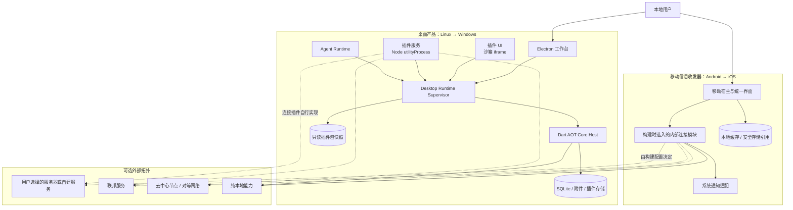
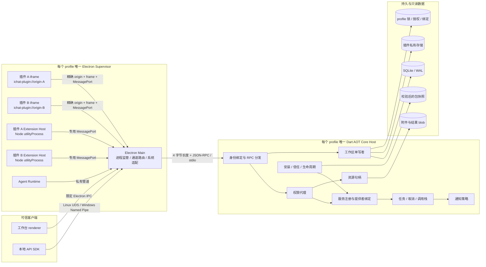
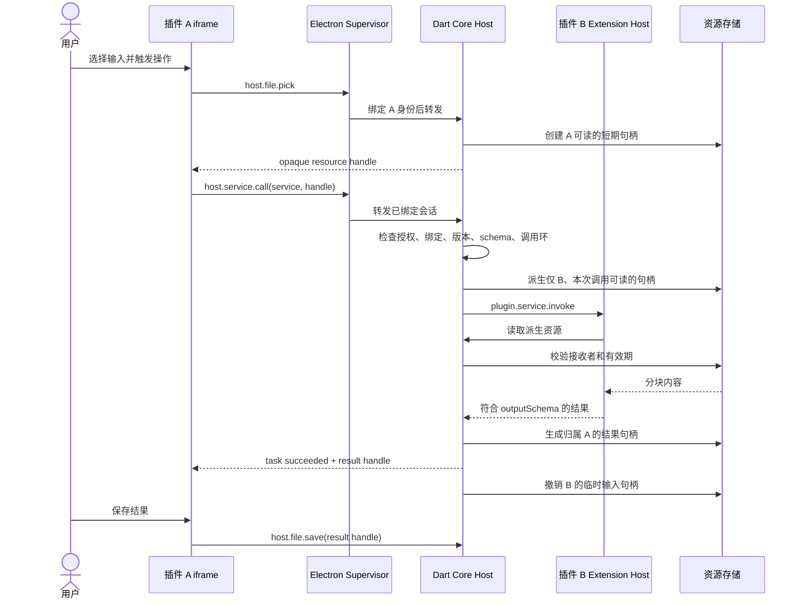
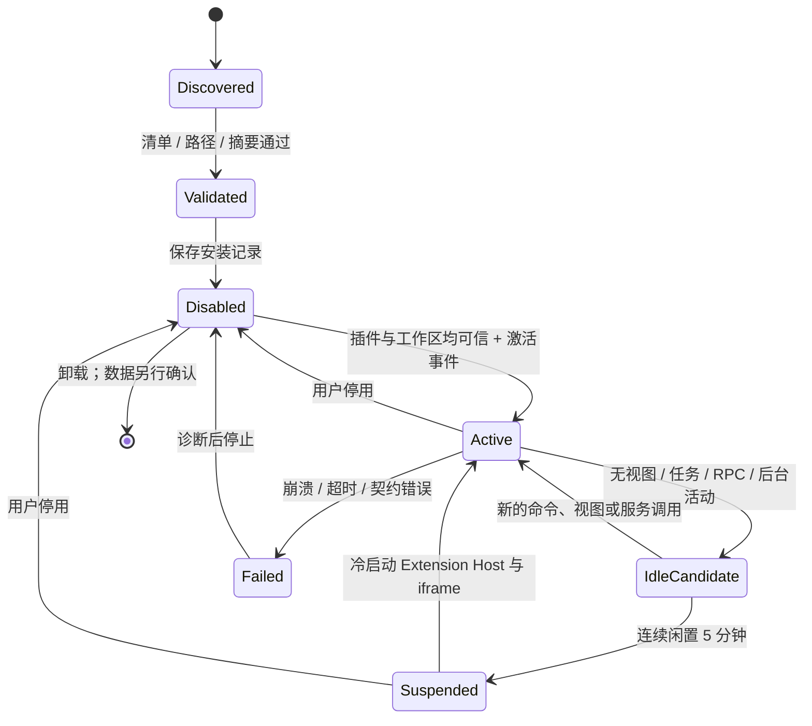
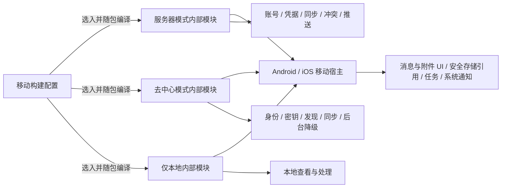

# InformetionChat 完整架构图

状态：桌面设计基线，2026-09-18。Linux、Windows 桌面架构已冻结但尚待实现验证；Android、iOS 只冻结产品与连接边界，技术栈在对应阶段决定。开发顺序固定为 Linux、Windows、Android、iOS，不规划 macOS。

## 1. 产品与部署全景

宿主没有统一账号、默认服务器或官方后台。桌面连接插件和移动内部连接模块分别决定是否需要账号、连接哪个服务、使用去中心协议或完全离线。桌面插件不会进入移动安装包，移动内部模块也不是可下载插件。

## 2. 桌面进程与通信

Supervisor 只监管进程、绑定通道身份和适配操作系统，不复制权限或业务规则。Core Host 是工作区唯一写入宿主；第二窗口和 Agent client 连接已有 Supervisor，不能创建第二个 Core 直接打开数据库。

## 3. 插件安全边界

```mermaid
flowchart TB
  Package[本地插件包]
  Stage[暂存、路径检查、摘要、只读快照]
  Consent{用户确认运行等级与来源}
  Restricted{工作区是否 trusted}

  subgraph WebTier[Web 沙箱 UI]
    Origin[按工作区 + 安装 + 摘要派生 origin]
    CSP[CSP + session 请求拦截]
    Bridge[窄 MessageChannel Bridge]
  end

  subgraph TrustedTier[受信任 Node.js 本地代码]
    ExtensionHost[每安装 Extension Host]
    SystemAccess[当前用户的文件 / 网络 / 进程权限]
  end

  subgraph FutureTier[后续受限计算]
    Wasm[WASM / OS 沙箱]
  end

  Package --> Stage --> Consent --> Restricted
  Restricted -->|trusted + runtime.ui| Origin --> CSP --> Bridge
  Restricted -->|trusted + runtime.extension| ExtensionHost --> SystemAccess
  Restricted -. 后续 .-> Wasm
```

Web UI 不能访问 Node.js、Electron、任意本地路径或网络。Node.js Extension Host 采用 VS Code 式信任模型，拥有当前用户的系统权限；宿主 API 权限不能限制恶意 Node.js 代码。需要强隔离的代码只能进入后续 WASM 或 OS 沙箱运行时。

## 4. 跨插件服务调用

插件之间没有直接通道。服务注册、提供者选择、参数校验、任务、取消和资源派生全部经过 Core Host。Agent 调用同一服务管线，只增加 Agent 会话、工具暴露和效果授权的交集检查。

## 5. 生命周期与资源策略

桌面进程组每秒统计 RSS。达到 4 GiB 时停止后台预热，达到 4.5 GiB 时拒绝新的后台激活并优先回收已闲置 5 分钟的运行时。超过 5 GiB 时展示进程、安装、任务和增长明细，建议用户审查；宿主不自动终止正在使用的插件。

## 6. 移动连接边界

移动端的低扩展性是主动取舍。新增协议或能力需要重新构建、测试和发布应用，以换取更少的配置、更小的攻击面和更稳定的使用体验。服务器模式才引入对应的账号、服务端同步和推送设计；去中心模式按自身协议处理身份、密钥和同步；仅本地模式不承诺跨设备或后台收信。

## 7. 设计依据

- [Electron 桌面宿主 ADR](adr/0009-electron-desktop-plugin-runtime.md)
- [Desktop Supervisor 与 Dart Core IPC](contracts/desktop-core-ipc.md)
- [UI Bridge](contracts/plugin-ui-jsonrpc.md)
- [Extension Host IPC](contracts/extension-host-ipc.md)
- [插件隔离与互通](本地插件隔离与互通.md)
- [客户端交付与插件边界](客户端交付与插件边界.md)
- [连接方式与服务中立](连接方式与服务中立.md)
