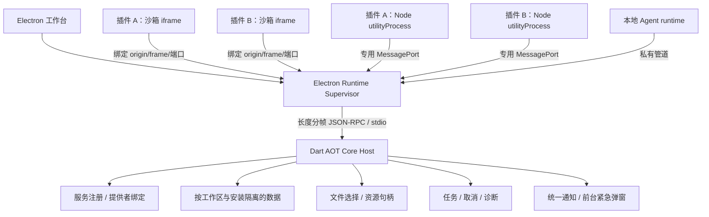

# InformetionChat 开发总文档

文档版本：1.4-draft · 2026-09-18。个人维护、以开源分发为目标；Dart 宿主核心与示例插件已有可运行演示，Electron 桌面客户端尚未实现，仓库尚未设置项目级 LICENSE。manifest 和 UI Bridge 仍为 1.2 草案，文档修订号不代表接口升级。

本文件是当前开发基线，完整附件见[开发文档索引](开发文档索引.md)。[ADR 0008](adr/0008-solo-developer-delivery-baseline.md)明确分阶段交付，[ADR 0009](adr/0009-electron-desktop-plugin-runtime.md)冻结 Electron 桌面宿主、VS Code 式插件信任和移动端精简策略；技术路线冲突时以 ADR 0009 为准。原始需求见[来源资料](../archive/2026-09-18/README.md)，问题与清理记录见[审查记录](设计审查与修改记录.md)。

## 1. 产品与首版目标

应用的重点是插件加载、隔离、互通和能力复用。Agent 和紧急通知作为首版插件能力的两个简单使用场景，验证同一套接口能被自动化调用、能向用户发出受控提醒。

“无官方”指没有官方团队、统一账号、项目方后台、认证体系或默认插件源。用户管理本地数据和授权，维护者维护宿主及随包代码，插件作者和服务提供方分别维护其交付。安装与调用无需向项目方申请账号、证书或审批。桌面宿主不处理业务账号认证；插件决定是否需要账号、连接哪个服务器、使用何种去中心协议或完全离线。

| 层 | 责任 |
|---|---|
| 宿主 | 工作区、权限、隔离、插件生命周期、服务注册与绑定、资源句柄、任务、通知展示和本地数据 |
| 随包基础模块 | 基础文件/归档查看、结果保存和插件管理；通过公开接口使用扩展能力 |
| 可选插件 | 格式转换、扩展视图、网络连接、行业能力；自行维护业务模型和契约 |
| Agent 适配器 | 把获授权插件服务映射为本地工具调用，不引入另一套业务实现 |

首版完成：加载两个离线 UI 插件 → 用户选择资源和提供者 → 插件间调用并保存结果 → Agent 调用同一服务并查询/取消任务 → 测试插件提交已授权的紧急通知并在前台弹窗。通知样例使用本地模拟事件，无需真实预警服务。

桌面端是主要产品，先在 Linux 验证以上流程，再完成 Windows 适配；随后依次设计 Android、iOS 轻量信息收发器。不规划 macOS。移动端不提供插件市场、本地包导入、开发加载、Agent 或第三方可执行插件。插件市场、服务运营、通用 Agent 编排和后台推送都不阻塞桌面首版。

## 2. 本地架构

桌面客户端采用 Electron，随应用固定 Chromium/Node.js 版本；Extension Host 通过 Electron `utilityProcess` 复用这套 Node，不另发一套运行时。现有 Dart `host_core` 构建为平台 AOT 可执行文件，用户无需安装 Dart SDK。Electron Supervisor 每个 profile 只启动一个 Core Host，并作为工作区唯一写入宿主；第二窗口和 Agent client 连接现有 Supervisor。传输、背压、恢复和单写者规则见 [Desktop Core IPC](contracts/desktop-core-ipc.md)。

Linux 是首个验证环境，随后适配 Windows。M0 验证 `ichat-plugin://<originKey>` 独立 origin、资源拦截、可信 Bridge、插件信任、Restricted Mode、5 GiB 审查阈值和闲置 5 分钟回收。正在使用的插件不按定时策略回收；超过阈值时提示用户审查，不自动终止。

插件 UI 不进入 Electron 主进程或工作台上下文；它运行在禁用 Node.js 的沙箱 iframe 中，通过绑定 origin 和端口的窄 Bridge 通信。插件服务运行在独立 Node.js 进程中，采用 VS Code 的信任模型：启用即允许它以当前用户权限执行代码，独立进程主要隔离崩溃和卡死，不是恶意代码沙箱。宿主权限只约束宿主 API。需要强制文件/网络隔离的插件后续使用 WASM 或 OS 沙箱运行时。

## 3. 首版范围和后续扩展

| 能力 | M1 首版 | 后续 |
|---|---|---|
| 插件管理 | 本地包加载、停用、卸载、手动更新、兼容诊断 | CLI、热重载、用户配置的目录源 |
| 隔离和权限 | iframe 独立 origin、每安装服务进程、来源/摘要确认、工作区 Restricted Mode、宿主 API 授权、超时与闲置回收 | WASM 或 OS 沙箱运行时；外部签名/扫描信号仅在有可维护基础设施时接入 |
| 互通和复用 | 服务发现、输入/输出 schema、用户绑定提供者、句柄传递；只解析已安装依赖 | 自动依赖获取、通用事件、聚合搜索和复杂工作流 |
| Agent | 交互模式与 headless `agent-api` profile；持久 stdio JSON-RPC runtime；插件可选注册模型工具；会话、取消和结构化结果 | Python/TypeScript SDK、MCP/远程适配、计划/执行和更多模型适配器 |
| 紧急通知 | 登记类别、来源授权、有效期/修订去重、前台宿主弹窗、关闭与撤回 | 系统通知、锁屏、后台接收、真实预警源 |
| 基础数据 | 文件/标准归档查看、选定范围导出和保存；更新前数据快照 | 大规模搜索、完整工作区备份恢复、跨设备同步 |
| 连接器 | 离线示例；iframe 与宿主代理无网络出口，受信 Extension Host 不承诺强制断网 | 按协议验证 HTTP/WebSocket 等传输、凭据和同步；需要时增加受限运行时 |

本地工作区免登录，所需基础模块随包交付。标准归档字段见 [chat-export.v1](contracts/chat-export.schema.json)，导入映射、附件缺失和备份边界见[数据规范](本地数据与备份恢复.md)。标准导出只有记录与附件清单，完整工作区恢复是独立能力。

桌面完整包是主产品；Linux 完成后适配 Windows，再依次设计 Android、iOS 信息收发器，不规划 macOS。移动端只包含随应用编译的内部连接模块并复用数据与服务协议，不追求运行时扩展性。构建时可以选择服务器、去中心或仅本地模块；账号、凭据、同步、冲突和后台到达由入包模块负责。见[客户端规范](客户端交付与插件边界.md)和[连接规范](连接方式与服务中立.md)。当前不存在完整客户端或平台支持证明。

## 4. 插件隔离和数据流

安装实例是最小授权单位，宿主将通道绑定到工作区、安装和运行会话。请求正文中的 ID 只用于关联，不能切换身份。

- 存储按 `workspaceId + installationId` 隔离，不向插件提供数据库连接或任意主机路径。
- 文件使用受控句柄，限定接收者、操作和有效期；选定一份文件不代表授权整个目录。
- 插件 iframe 默认没有网络出口；宿主代理不向 `connectivity: offline` 插件提供网络能力。已信任的 Node.js 插件服务拥有当前用户的系统权限，可能绕过宿主直接访问文件和网络；安装确认必须明确这一风险。
- 跨插件调用检查调用权限与数据传递权限。提供者不能借自身权限替调用者读取其他数据；服务结果、日志、事件和通知均不能绕过访问边界。
- 停用撤销通道、服务、任务和句柄，保留数据。删除插件数据单独确认；已导入宿主的标准记录仍可查看和导出。

随包、作者身份、开源或签名均不扩大宿主 API 权限；它们只作为插件是否值得信任的判断信号。项目不运营默认插件源、签名、扫描或阻止列表，首版本地包的来源判断由用户承担；宿主负责准确展示路径、摘要和代码执行风险。具体威胁边界、平台验证和历史数据处理见[隔离规范](本地插件隔离与互通.md)。

## 5. 服务和依赖

首版以“查看器消费转换服务”为验收主线。服务提供者附带接口版本、参数/结果 JSON Schema、效果、可选 `agentCallable` 和 `requiresUI`。只有显式设置 `agentCallable: true` 且 `requiresUI: false` 的服务才可能注册为模型工具；省略或为 false 时只供用户/插件使用。宿主校验结构及实际资源权限，先绑定提供者再调用；已有绑定不会被新插件覆盖。

M1 只解析本地已安装候选，按精确版本、摘要和来源锁定。必需包依赖和服务绑定的激活图必须无环；缺失或冲突时展示依赖链，用户安装兼容包或重新选择提供者。暂不自动下载依赖、切换来源或加载同 ID 的多个活动版本。

提供者超时、失效、停用或取消返回明确任务状态。只读调用可按契约重试；有副作用操作不得隐式重试或广播。插件互通和 Agent 使用同一服务实现，避免维护两套转换逻辑。完整规则见[依赖与复用](插件依赖与能力复用.md)和[UI Bridge](contracts/plugin-ui-jsonrpc.md)。

## 6. Agent 与 API 模式

Agent 借鉴 DeepSeek Harness 的运行模式，提供桌面交互外壳和 headless `agent-api` profile。两者共用会话日志、模型适配器、工具注册表和审批策略。API SDK 延迟启动固定版本的 runtime 子进程，要求显式 Agent home、workspace、profile、session 和模型配置，在多个 `run` 之间复用进程；stdout 只输出 JSON-RPC，stderr 承载诊断，不默认开放网络端口。

插件通过 `agentCallable: true` 可选把服务加入模型工具表。工具 schema 来自服务契约，实际列表再与 profile、提供者绑定、会话授权、资源和效果取交集；模型不能选择其他安装或批准自己。M1 只开放预授权的本地 read/write 转换工具，不开放发送、删除、安装、网络或 shell。

`agent.run` 从输入持久化运行到会话再次 idle，返回 finalResponse、finishReason、事件摘要和通知；流式输出、工具进度和审批请求走独立 notification。插件服务与 iframe UI 生命周期分离，声明 `requiresUI: false` 的工具必须能在页面未打开时运行。完整协议和验收见 [Agent API](contracts/agent-api.md)。

## 7. 紧急通知简单目标

插件在 manifest 中登记通知类别和最高等级，用户为指定安装、来源和类别开启紧急弹窗。之后有效事件可以直接在应用前台弹出，无需逐条确认发送；关闭弹窗只表示用户已看到，不向来源发送回执。

首版保留四级枚举，重点验证 `critical`：宿主显示真实安装来源、时间和关闭/查看操作，按 eventId/修订去重，过期或已撤回事件不能因重连再次弹出。缺少授权按允许等级降级，不允许插件自行提升权限。

应用后台、退出、断网或无系统通知能力时，首版只记录可证明的处理状态，不承诺及时送达。地震预警等仅作为未来来源示例；首版使用本地测试通知，不依赖官方数据源、推送中继或操作系统关键提醒许可。详见[通知规范](通知分级与紧急提醒.md)。

## 8. 加载、更新和契约状态

选择本地包/测试目录 → 复制到宿主管理暂存区 → 检查清单、路径、内容摘要及支持能力 → 解析已安装依赖 → 用户授权 → 激活只读快照。开发目录也不直接执行校验后可变化的原文件。检查无需发布账号、证书或服务器。

M1 手动更新，展示实际来源、版本、摘要与权限变化。同名自述 ID 不能自动覆盖已有来源。升级前停止运行实例并保留包及数据快照，迁移失败同时恢复；不能只回退代码。未知权限、未知必需能力或尚不支持的运行时拒绝激活。

[manifest](contracts/plugin-manifest.schema.json)、[包格式](contracts/plugin-package-format.md)、[权限矩阵](governance/permission-matrix.md)和各契约均为设计草案。Schema 校验通过不代表运行时隔离成立。本地 SDK 以 UI Bridge 和 Agent 契约为依据；后续 Worker 接口需单独定义和验证。

格式转换插件已迁移到 manifest 1.2、标准归档字段（`messages`/`authorId`）、正式服务声明与资源句柄，页面内联脚本已外置以符合自带 CSP。这些是首个可运行实现的组成部分，但宿主仍是无头演示：Electron 外壳、沙箱 iframe、插件信任和 Restricted Mode 尚未实现，方法级 schema 未冻结。具体范围与缺口见[开发环境与运行说明](开发环境与运行说明.md)。

[骨科附录](第三方骨科插件需求.md)只保留可选业务需求，不引入团队账号、医疗后台或宿主专属表。

## 9. 实施与验收

| 阶段 | 交付 | 退出条件 |
|---|---|---|
| M0：Linux 桌面可行性 | Electron Supervisor、Dart AOT Core、沙箱 iframe、可信 Bridge、插件信任、Restricted Mode 和回收 | 独立 origin/存储、UI 网络与文件出口阻断、子框架伪造拒绝；单 Core 写入与崩溃恢复；未信任/受限工作区不执行插件；5 分钟闲置回收、5 GiB 审查提示和卡死回收；记录运行时与系统版本。失败时关闭第三方插件入口 |
| M1：插件功能首版 | 两个本地插件互通；`agent-api` profile 通过可选插件工具调用同一服务；授权紧急通知前台弹窗 | 成功转换与结果保存、越权拒绝、提供者冲突、循环依赖拒绝、超时/取消、停用撤销；API runtime 可复用/恢复、stdout 纯协议、Agent 无页面点击完成工具调用；未授权/过期/重复通知不能错误弹窗；更新失败数据可恢复 |
| M2：Windows 与开发完善 | Windows 桌面适配、CLI/热重载、更多依赖诊断、通用事件、搜索和完整备份恢复 | Windows IPC、路径、安装包和通知实测；数据往返、恢复演练、事件丢失可查询、开发加载保持隔离 |
| M3：Android 与按需扩展 | Android 轻量信息收发器、WASM/沙箱运行时、联网连接器、用户配置目录源或后台通知 | Android 不出现第三方插件入口；各扩展单独验证运行环境、契约、外部服务和维护条件，通过后加入支持列表 |
| M4：iOS 适配 | 在 Android 已冻结的移动协议和交互基础上适配 iOS | iOS 构建、设备、后台、通知、安全存储和渠道规则分别通过验证；不引入第三方插件入口 |

初始预算：控制消息 1 MiB、普通调用 30 秒、每安装并发 4、调用深度 4；桌面进程组总常驻内存超过 5 GiB 时提示用户审查。使用中的插件不做 5 分钟定时回收；符合闲置条件满 5 分钟后回收。长任务返回 taskId；强制停止后 2 秒内宿主恢复可操作为待测目标。测试记录需注明硬件、系统、Electron/Chromium/Node.js/Dart AOT、输入大小、实际耗时及失败原因；不能把设计目标写成实测结果。

首次分发前确认项目 LICENSE、依赖许可、固定工具链、构建命令和测试平台版本。安装包附内容摘要与发布来源说明，更新由用户触发。操作系统/渠道要求的应用签名由发布者配置，与插件认证无关；缺少构建、硬件或渠道验证的端保持未验证。

当前完成首次实现：宿主核心与三个示例插件可运行，M1 三条主线与负向用例全部通过。桌面技术路线已经冻结；Electron 外壳、iframe Bridge、插件信任/Restricted Mode、Agent API runtime/SDK、方法级 schema 与自动化测试套件仍未实现。下一步按 [ADR 0009](adr/0009-electron-desktop-plugin-runtime.md)完成 M0 原型与隔离实测。
