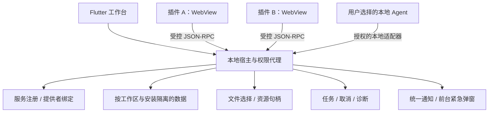

# InformetionChat 开发总文档

文档版本：1.3-draft · 2026-09-18。个人维护、以开源分发为目标；当前为设计及插件原型，宿主尚未实现，仓库尚未设置项目级 LICENSE。manifest 和 UI Bridge 仍为 1.2 草案，文档修订号不代表接口升级。

本文件是当前开发基线，完整附件见[开发文档索引](开发文档索引.md)。[ADR 0008](adr/0008-solo-developer-delivery-baseline.md)明确插件优先、Agent 与紧急通知采用简单目标；与此前交付顺序冲突时以该决策为准。本地宿主原则已合并到当前决策和专项规范。原始需求见[来源资料](../archive/2026-09-18/README.md)，问题与清理记录见[审查记录](设计审查与修改记录.md)。

## 1. 产品与首版目标

应用的重点是插件加载、隔离、互通和能力复用。Agent 和紧急通知作为首版插件能力的两个简单使用场景，验证同一套接口能被自动化调用、能向用户发出受控提醒。

“无官方”指没有官方团队、统一账号、项目方后台、认证体系或默认插件源。用户管理本地数据和授权，维护者维护宿主及随包代码，插件作者和服务提供方分别维护其交付。安装与调用无需向项目方申请账号、证书或审批。

| 层 | 责任 |
|---|---|
| 宿主 | 工作区、权限、隔离、插件生命周期、服务注册与绑定、资源句柄、任务、通知展示和本地数据 |
| 随包基础模块 | 基础文件/归档查看、结果保存和插件管理；通过公开接口使用扩展能力 |
| 可选插件 | 格式转换、扩展视图、网络连接、行业能力；自行维护业务模型和契约 |
| Agent 适配器 | 把获授权插件服务映射为本地工具调用，不引入另一套业务实现 |

首版完成：加载两个离线 UI 插件 → 用户选择资源和提供者 → 插件间调用并保存结果 → Agent 调用同一服务并查询/取消任务 → 测试插件提交已授权的紧急通知并在前台弹窗。通知样例使用本地模拟事件，无需真实预警服务。

四端保留为目标，先在一个桌面平台验证以上流程，再逐端适配。市场、服务运营、通用 Agent 编排和后台推送都不阻塞首版。

## 2. 本地架构

客户端候选为 Flutter/Dart + 平台 WebView。Linux 暂作首个验证环境，M0 需确认 Flutter 绑定、系统依赖、独立存储、资源拦截和运行时回收；若不可行，可切换 Windows 验证。Flutter 跨平台不代表各端已有合格插件沙箱。

插件代码不进入 Flutter 主执行环境。WebView 采用独立源、存储和消息通道，网络、导航、文件及系统出口由宿主阻断或代理。不能有效阻断的平台关闭外部插件入口，调整运行时后再开放。本地 WASM Worker 是后续计算扩展，首版 UI 插件不依赖它。

## 3. 首版范围和后续扩展

| 能力 | M1 首版 | 后续 |
|---|---|---|
| 插件管理 | 本地包加载、停用、卸载、手动更新、兼容诊断 | CLI、热重载、用户配置的目录源 |
| 隔离和权限 | 每安装独立上下文、资源授权、超时取消和回收 | 各平台适配、Worker 与资源预算 |
| 互通和复用 | 服务发现、输入/输出 schema、用户绑定提供者、句柄传递；只解析已安装依赖 | 自动依赖获取、通用事件、聚合搜索和复杂工作流 |
| Agent | 本地授权会话、发现/描述、直接调用已授权服务、任务查询/取消、读取结果 | MCP/远程适配、计划/执行、安装管理、自动编排 |
| 紧急通知 | 登记类别、来源授权、有效期/修订去重、前台宿主弹窗、关闭与撤回 | 系统通知、锁屏、后台接收、真实预警源 |
| 基础数据 | 文件/标准归档查看、选定范围导出和保存；更新前数据快照 | 大规模搜索、完整工作区备份恢复、跨设备同步 |
| 连接器 | 离线示例，插件默认无网络出口 | 按协议验证 HTTP/WebSocket 等传输、凭据和同步 |

本地工作区免登录，所需基础模块随包交付。标准归档字段见 [chat-export.v1](contracts/chat-export.schema.json)，导入映射、附件缺失和备份边界见[数据规范](本地数据与备份恢复.md)。标准导出只有记录与附件清单，完整工作区恢复是独立能力。

移动基础包与桌面完整包是目标配置，见[客户端规范](客户端交付与插件边界.md)；当前不存在完整客户端或四端支持证明。

## 4. 插件隔离和数据流

安装实例是最小授权单位，宿主将通道绑定到工作区、安装和运行会话。请求正文中的 ID 只用于关联，不能切换身份。

- 存储按 `workspaceId + installationId` 隔离，不向插件提供数据库连接或任意主机路径。
- 文件使用受控句柄，限定接收者、操作和有效期；选定一份文件不代表授权整个目录。
- 首版所有插件无网络出口。未来开放网络时，读取过离线输入的安装不能原地改为联网安装；使用空存储的新安装并重新选择要分享的数据。
- 跨插件调用检查调用权限与数据传递权限。提供者不能借自身权限替调用者读取其他数据；服务结果、日志、事件和通知均不能绕过访问边界。
- 停用撤销通道、服务、任务和句柄，保留数据。删除插件数据单独确认；已导入宿主的标准记录仍可查看和导出。

随包、作者身份、开源或签名均不增加权限。具体威胁边界、平台验证和历史数据处理见[隔离规范](本地插件隔离与互通.md)。

## 5. 服务和依赖

首版以“查看器消费转换服务”为验收主线。服务提供者附带接口版本、参数/结果 JSON Schema、效果、`agentCallable` 和 `requiresUI`。宿主校验结构及实际资源权限，先绑定提供者再调用；已有绑定不会被新插件覆盖。

M1 只解析本地已安装候选，按精确版本、摘要和来源锁定。必需包依赖和服务绑定的激活图必须无环；缺失或冲突时展示依赖链，用户安装兼容包或重新选择提供者。暂不自动下载依赖、切换来源或加载同 ID 的多个活动版本。

提供者超时、失效、停用或取消返回明确任务状态。只读调用可按契约重试；有副作用操作不得隐式重试或广播。插件互通和 Agent 使用同一服务实现，避免维护两套转换逻辑。完整规则见[依赖与复用](插件依赖与能力复用.md)和[UI Bridge](contracts/plugin-ui-jsonrpc.md)。

## 6. Agent 简单目标

宿主运行时，用户通过可信宿主界面建立一个限定工作区、服务、提供者、输入和输出范围的本地 Agent 会话。适配器先采用本地 stdio/IPC，不默认开放网络端口。

Agent 能发现并描述服务、调用已授权的转换操作、查询/取消任务、读取结果引用。用户预先选定资源后无需重复选择；缺少授权或提供者时返回明确错误，由宿主界面处理。首版不要求自动规划、模型托管、消息发送、安装插件或无宿主进程后台运行。

插件服务即使通过 WebView 实现，也需能在无需用户点击其页面时被调用；声明 `requiresUI: false` 的服务要实际验证这一点。Agent 只能读取自身会话范围内的结果。协议和验收见 [Agent API](contracts/agent-api.md)。

## 7. 紧急通知简单目标

插件在 manifest 中登记通知类别和最高等级，用户为指定安装、来源和类别开启紧急弹窗。之后有效事件可以直接在应用前台弹出，无需逐条确认发送；关闭弹窗只表示用户已看到，不向来源发送回执。

首版保留四级枚举，重点验证 `critical`：宿主显示真实安装来源、时间和关闭/查看操作，按 eventId/修订去重，过期或已撤回事件不能因重连再次弹出。缺少授权按允许等级降级，不允许插件自行提升权限。

应用后台、退出、断网或无系统通知能力时，首版只记录可证明的处理状态，不承诺及时送达。地震预警等仅作为未来来源示例；首版使用本地测试通知，不依赖官方数据源、推送中继或操作系统关键提醒许可。详见[通知规范](通知分级与紧急提醒.md)。

## 8. 加载、更新和契约状态

选择本地包/测试目录 → 复制到宿主管理暂存区 → 检查清单、路径、内容摘要及支持能力 → 解析已安装依赖 → 用户授权 → 激活只读快照。开发目录也不直接执行校验后可变化的原文件。检查无需发布账号、证书或服务器。

M1 手动更新，展示实际来源、版本、摘要与权限变化。同名自述 ID 不能自动覆盖已有来源。升级前停止运行实例并保留包及数据快照，迁移失败同时恢复；不能只回退代码。未知权限、未知必需能力或尚不支持的运行时拒绝激活。

[manifest](contracts/plugin-manifest.schema.json)、[包格式](contracts/plugin-package-format.md)、[权限矩阵](governance/permission-matrix.md)和各契约均为设计草案。Schema 校验通过不代表运行时隔离成立。本地 SDK 以 UI Bridge 和 Agent 契约为依据；后续 Worker 接口需单独定义和验证。

格式转换页面目前使用旧桥接和 `records` 字段，尚未迁移到 `messages`、正式服务和资源句柄，不能用于宣称首版已完成。[骨科附录](第三方骨科插件需求.md)只保留可选业务需求，不引入团队账号、医疗后台或宿主专属表。

## 9. 实施与验收

| 阶段 | 交付 | 退出条件 |
|---|---|---|
| M0：单桌面可行性 | WebView、可信桥接、插件上下文和回收 | 独立源/存储、网络及文件出口阻断、子框架伪造拒绝、卡死回收；记录系统与 WebView 版本。失败时关闭外部插件并调整方案 |
| M1：插件功能首版 | 两个离线插件互通；Agent 调用同一服务；授权紧急通知前台弹窗 | 成功转换与结果保存、越权拒绝、提供者冲突、循环依赖拒绝、超时/取消、停用撤销；Agent 无页面点击完成调用；未授权/过期/重复通知不能错误弹窗；更新失败数据可恢复 |
| M2：开发与数据完善 | CLI/热重载、更多依赖诊断、通用事件、搜索和完整备份恢复 | 数据往返、恢复演练、事件丢失可查询、开发加载保持隔离 |
| M3：逐项扩展 | 第二桌面平台、移动端、Worker、联网连接器、目录源或后台通知 | 每项单独验证运行环境、契约、外部服务和维护条件，通过后加入支持列表 |

初始预算：控制消息 1 MiB、普通调用 30 秒、每安装并发 4、调用深度 4。长任务返回 taskId；强制停止后 2 秒内宿主恢复可操作为待测目标。测试记录需注明硬件、系统、WebView、输入大小、实际耗时及失败原因；不能把建议值写成实测结果。

首次分发前确认项目 LICENSE、依赖许可、固定工具链、构建命令和测试平台版本。安装包附内容摘要与发布来源说明，更新由用户触发。操作系统/渠道要求的应用签名由发布者配置，与插件认证无关；缺少构建、硬件或渠道验证的端保持未验证。

当前完成设计修订，宿主、沙箱、Agent 适配器、通知弹窗及安装包均待实现。
